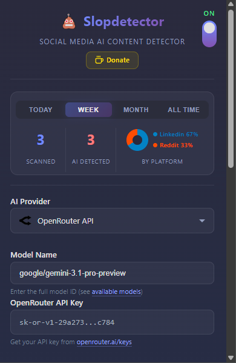
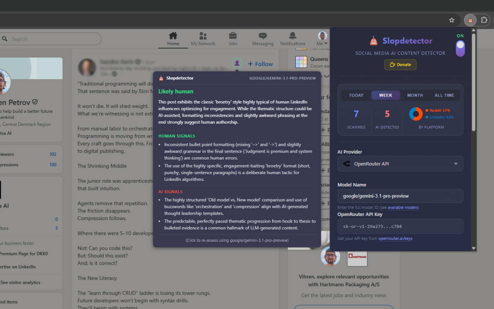
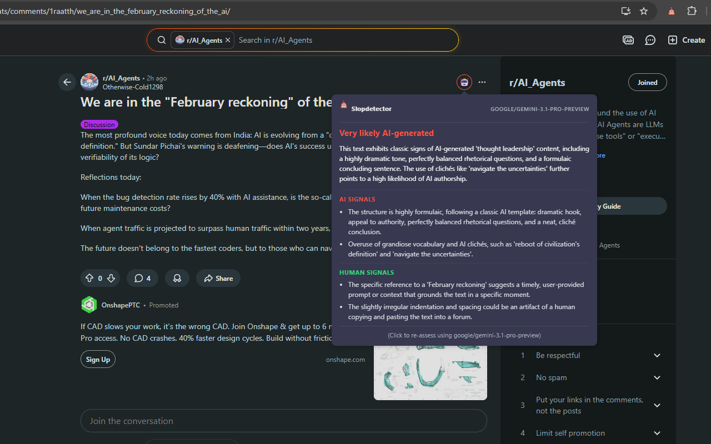

<p align="center">
  
</p>

<h1 align="center">Slopdetector</h1>

<p align="center">
  <strong>AI Content Detector for Social Media</strong><br>
  Detect AI-generated posts and comments on Reddit and LinkedIn using your choice of LLM provider.
</p>

<p align="center">
  <a href="#installation">Installation</a> •
  <a href="#getting-started">Getting Started</a> •
  <a href="#features">Features</a> •
  <a href="#supported-platforms">Platforms</a> •
  <a href="#ai-providers">Providers</a> •
  <a href="#contributing">Contributing</a>
</p>

<p align="center">
  <a href="https://buymeacoffee.com/vihrenp" title="Support this project">
    
  </a>
</p>

---

## What Is Slopdetector?

Slopdetector is a browser extension that helps you identify AI-generated content ("slop") on social media. It adds a scan button to posts and comments, sends the text to an LLM of your choice for analysis, and shows you a confidence score indicating how likely the content is to be AI-generated.

## Screenshots

<p align="center">
  
</p>

<p align="center">
  <em>The Slopdetector extension — choose your AI provider, view scan statistics and customize your settings.</em>
</p>

<p align="center">
  
  
</p>

<p align="center">
  <em>Left: LinkedIn post flagged as "Likely human". Right: Reddit post flagged as "Very likely AI-generated" — both showing "Detailed Reasoning" signals.</em>
</p>

## Supported Platforms

| Platform | Status | Notes |
|----------|--------|-------|
| **Reddit** | ✅ Supported | Posts and comments on `reddit.com` and `old.reddit.com` |
| **LinkedIn** | ✅ Supported | Feed posts including suggested and sponsored content |
| X / Twitter | 🔜 Coming soon! | — |

More platforms will be added based on popular demand. Feel free to [submit a request.](https://github.com/webs7er/Slopdetector/issues/new).

## Browser Compatibility

| Browser | Status |
|---------|--------|
| **Google Chrome** | ✅ Supported |
| **Microsoft Edge** | ✅ Compatible (Chromium-based) |
| **Brave** | ✅ Compatible (Chromium-based) |
| **Opera** | ✅ Compatible (Chromium-based) |
| **Firefox** | ❌ Not supported (Manifest V3) |

## Features

-  **On-demand scanning** — Click the scan button on any post to analyze it
- 🤖 **Multi-provider support** — Use LM Studio (Local), Anthropic API (Claude), OpenAI API (ChatGPT), or OpenRouter API
- 🎯 **Adjustable sensitivity** — Drag-to-resize zone bar for fine-tuning detection thresholds
- 📊 **Scan statistics** — Track your scans over time with daily, weekly, monthly, and all-time breakdowns by platform
- 💬 **Detailed reasoning** — See human vs. AI signals explaining why content was flagged
- 🧪 **Customizable prompts** — Override the system prompt and output format for advanced use
- 🔒 **Privacy-friendly** — Use LM Studio for fully local, offline analysis with no data leaving your machine

## Installation

### From the Chrome Web Store

[Install Slopdetector from the Chrome Web Store](https://chromewebstore.google.com/detail/klddclokoaiflemooohmomoljkpcjalf?utm_source=item-share-cb)

### Manual Installation (Developer Mode)

1. **Download** — Clone or download this repository:
   ```bash
   git clone https://github.com/webs7er/Slopdetector.git
   ```
2. **Open the extensions page** — Navigate to `chrome://extensions/` in Chrome (or `edge://extensions/` in Edge, etc.)
3. **Enable Developer Mode** — Toggle the switch in the top-right corner
4. **Load the extension** — Click **"Load unpacked"** and select the project folder
5. **Pin it** — Click the puzzle-piece icon in the toolbar and pin **Slopdetector** for easy access

## Getting Started

### 1. Choose an AI Provider

Click the Slopdetector icon in your toolbar to open settings. Select one of the supported providers:

| Provider | Type | Requirements |
|----------|------|--------------|
| **LM Studio** | Local | [Download LM Studio](https://lmstudio.ai/), load a model, and start the local server (default: `http://localhost:1234`) |
| **OpenAI** | Cloud | Requires an [API key](https://platform.openai.com/api-keys) |
| **Anthropic (Claude)** | Cloud | Requires an [API key](https://console.anthropic.com/settings/keys) |
| **OpenRouter** | Cloud | Requires an [API key](https://openrouter.ai/keys) — access to 100+ models through a single API |

### 2. Scan a Post

1. Navigate to **Reddit** or **LinkedIn**
2. Look for the scan button () next to posts and comments
3. Click it to analyze the content
4. View the result indicator:

| Indicator | Meaning |
|-----------|---------|
| 🟢 Green | Likely written by a human |
| 🟡 Yellow | Ambiguous — could be either |
| 🟠 Orange | Likely AI-generated |
| 🔴 Red | High confidence AI-generated |

5. Hover over the indicator to see the confidence score and detailed reasoning

### 3. Customize Your Settings

- **Show Certainty %** — Display the raw confidence score
- **Detailed Reasoning** — Show human and AI signals explaining the verdict
- **Minimum Post Length** — Skip short posts below a word count threshold
- **Detection Sensitivity** — Adjust the score boundaries between human/ambiguous/AI zones

#### Experimental Features

Under the expandable **Experimental Features** section you can:
- Adjust the **model temperature** (precision vs. creativity)
- Edit the **system prompt** and **output format** for custom analysis behavior
- Fine-tune the **AI-content score sensitivity** zones with a visual drag-to-resize bar

## AI Providers

| Provider | Type | Details |
|----------|------|---------|
| **LM Studio (Local)** | Local | Run models entirely on your machine — no data leaves your computer. [Download LM Studio](https://lmstudio.ai/), load a model, and start the local server (default: `http://localhost:1234`) |
| **Anthropic API (Claude)** | Cloud | Requires an [API key](https://console.anthropic.com/settings/keys) from Anthropic |
| **OpenAI API (ChatGPT)** | Cloud | Requires an [API key](https://platform.openai.com/api-keys) from OpenAI |
| **OpenRouter API** | Cloud | Requires an [API key](https://openrouter.ai/keys) — access to 100+ models through a single API |

## How It Works

1. Slopdetector injects scan buttons into supported social media pages
2. When you click a scan button, the post text is extracted and sent to your configured LLM provider
3. The LLM analyzes linguistic patterns — formality, hedging phrases, sentence variety, personal anecdotes, emotional depth, and more
4. The result comes back as a structured JSON with a probability score and reasoning
5. A color-coded indicator replaces the scan button, showing the verdict at a glance

Results are cached per post so re-scanning is instant.

## Privacy

- **LM Studio** runs entirely on your machine — no data leaves your computer.
- **Cloud providers** (OpenAI, Claude, OpenRouter) send post text to their APIs for analysis. Your API keys are stored locally in Chrome's extension storage and are never shared.
- Slopdetector does **not** collect, store, or transmit any browsing data or analytics.

## Troubleshooting

<details>
<summary><strong>Scan buttons don't appear</strong></summary>

- Make sure detection is **enabled** (toggle in the header)
- Check that posts meet the **minimum word count** (if the filter is enabled)
- Try refreshing the page — some dynamically loaded content needs a reload

</details>

<details>
<summary><strong>Connection issues with LM Studio</strong></summary>

- Ensure LM Studio is running and a model is loaded
- Verify the server URL in settings matches your LM Studio config (default: `http://localhost:1234`)
- Check that the LM Studio server is actually started (look for the server toggle in LM Studio)

</details>

<details>
<summary><strong>Slow or failed analysis</strong></summary>

- Cloud providers may have rate limits — wait a moment and try again
- For LM Studio, try a smaller/faster model
- Increase the **minimum post length** filter to reduce the number of API calls
- If the error persists, [submit an issue.](https://github.com/webs7er/Slopdetector/issues/new).

</details>

## Contributing

Contributions are welcome! Feel free to open issues or submit pull requests.

1. Fork the repository
2. Create a feature branch (`git checkout -b feature/my-feature`)
3. Commit your changes (`git commit -m 'Add my feature'`)
4. Push to the branch (`git push origin feature/my-feature`)
5. Open a Pull Request

## License

This project is licensed under the [MIT License](LICENSE).

## Disclaimer

Slopdetector provides **estimates** based on LLM analysis and is not 100% accurate. Use it as a helpful indicator, not as definitive proof of AI-generated content. Accuracy depends on the quality of the LLM model you use.
